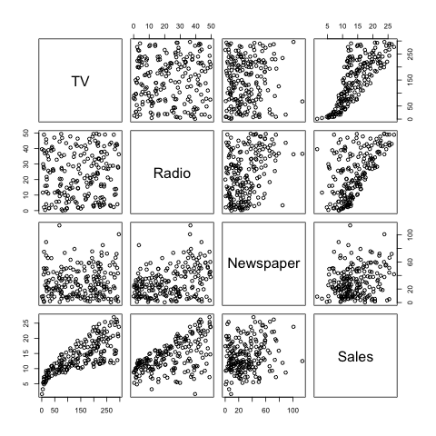
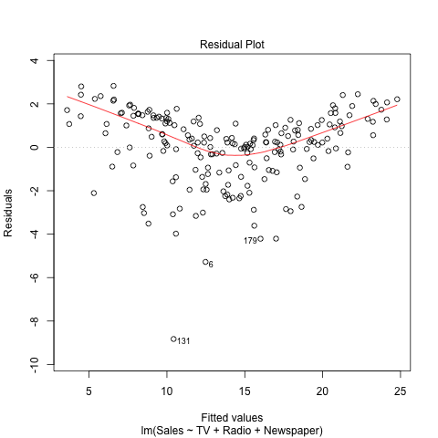

##Abstract
In this report we will reproduce the regression results on sales and advertising effectiveness displayed in section 3.2 Multiple Linear Regression (Chapter 3) of the book [**An Introduction to Statistical Learning**](http://www-bcf.usc.edu/~gareth/ISL/).

#Introduction
The specific goal of this report is to examine the relationship between sales (in terms of thousands of units sold) and advertising budget (in thousands of dollars). We will develop a simple linear regression model that will be used to predict sales on the basis of each of the three media budgets (**TV**, **Radio**, and **Newspaper**), as well as a multiple linear regression model used to predict sales on all three of the media budget types. This examination will allow us to better understand the effectiveness of different methods of advertising and improve the use of advertising to increase sales.

#Data
The Advertising data set, downloaded from _**An Introduction to Statistical Learning**_, consists of **Sales** (in thousands of units) of a particular product in 200 different markets, along with advertising budgets (in thousands of dollars) for the product in each of those markets for three different media: TV, Radio, and Newspaper.

#Methodology
For this report, we will only be using both simple linear regression as well as multiple linear regression.

### Simple Linear Regression
We'll be looking at each media type from the data set. We will examine the relationship of **Sales** of this product with **TV**/**Radio**/**Newspaper** advertising budget. We will use a simple linear model:
\begin{center}
 Sales  = $\beta_0$ + $\beta_1$ * TV/Radio/Newspaper
\end{center}
To estimate the coefficients $\beta_0$ and $\beta_1$, we will fit a regression model via the least squares criterion.

### Multiple Linear Regression
We will be looking at all the media types collectively and fit a multiple linear regression on sales taking all of the predictors into consideration. We will use the following model:
\begin{center}
 Sales  = $\beta_0$ + $\beta_1$ * TV + $\beta_2$ * Radio + $\beta_3$ * Newspaper
\end{center}
We will fit a regression model via the least squares criterion.

#Results
First, we will compute the multiple linear regression coefficients. The results is listed in the table below:

```{r,results = 'asis', echo=FALSE}
library(xtable)
load(file = "../data/regression.RData")
print(xtable(summary(regTV),caption="Simple Linear Regression Coefficients - TV"),comment=FALSE)
print(xtable(summary(regRadio),caption="Simple Linear Regression Coefficients - Radio"),comment=FALSE)
print(xtable(summary(regNewspaper),caption="Simple Linear Regression Coefficients - Newspaper"),comment=FALSE)
```

From this table, we can see that the coefficient for the regression of number of units sold on TV advertising budget indicates that an increase of $1,000 in the TV advertising budget will yield an increase in sales by 47.5 units. Similarly, an increase in Radio ad budget by $1,000 can increase sales by 203 units. An increase in Newspaper ad budget can increase sales by 55 units. The coefficients of $\beta_0$ and $\beta_1$ for each of the simple linear regression models are quite large relative to their standard errors, and their t-stats are also quite large. This seems to indicate that $\beta_0$ and $\beta_1$ are significant for each of the models, and that the null hypothesis that there's no relationship between the TV/Radio/Newspaper ad budget and number of units sold can be rejected.

However, This may be misleading. Simply fitting a separate linear regression model for each of the predictor ignores the possibility that some of the predictor variables may be correlated, and that would affect the accuracy of the model prediction.

Therefore, we are going to use the multiple linear regression method, and regress Sales on all three of the predictors TV, Radio and Newspaper. The coefficients for this model is listed in Table 4.

```{r,results = 'asis', echo=FALSE}
print(xtable(summary(regression),caption="Multiple Linear Regression Coefficients"),comment=FALSE)
```

Looking at this table, we can see that for a given amount of Radio and Newspaper ad budgets, an increase in TV budget by $1,000 can yield an increase in sales by 46 units. Similarly, an increase in Radio budget will yield an increase in sales by 189 units. The t-statistics for TV and Radio predictors are both quite high. However, we can notice that the Newspaper budget predictor has close to 0 effect on sales, and the t-statistics is really low. This seems interesting as in the previous simple linear regression of sales on newspaper, we see a pretty significant effect. Let's see why this may be the case.

Let's take a look at the correlation matrix of the predictor variables and the response variable displayed in Table 5.

```{r,results = 'asis', echo=FALSE}
load("../data/correlation-matrix.RData")
print(xtable(corrmat, caption = "Correlation Matrix"),comment=FALSE)
```

We can see that correlation between radio and newspaper is 0.35. This means that spending on Newspaper is very likely accompanied by spending on Radio. This suggests that the relationship found in the simple linear regression of sales on newspaper may not be a direct effect of newspaper ad on sales, but an indirect effect of radio ad on sales.

We can also take a look at the pairs scatterplot of the predictor variables and response variable. We can observe the same correlation in the chart.



Now that we have determined the relationship of the sales with the three types of media through the multiple linear regression model, let's look at how well this regression model fits the data. We computed the Regression Quality Indices listed in the table below:

```{r,results = 'asis', echo=FALSE}
rqi <- data.frame(c("Residual standard errors","R2","F-stat"),c(summary(regression)$sigma,summary(regression)$r.squared,summary(regression)$fstatistic[1]))
colnames(rqi)<- c("Quantity","Value")
table_rqi <- xtable(rqi,caption = "Regression quality Indices")
print(table_rqi,comment=FALSE)
```

Looking at this table, a RSE of 1.69 on this regression model seems pretty decent. A 1690 units of average predicted deviation from sales is good relative to mean of Sales data of 14.0 thousand units, and this indicates that the fit of regression line to the data is pretty good. R squared of 0.891 also seems to confirm the fit of the regression line to the data, 89.7% of the variability in sales can be explained by the regression on TV, Newspaper and Radio ad budget. The F-statistics of 570 is also significantly larger than 1, which is compelling evidence against the null hypothesis. We can conclude that at least one of the three media types is associated with increase in sales.

In fact we can observe the goodness of it in our residuals plot shown below.



The deviation of the scatterplot from the regression line quite good.

#Conclusion
In conclusion, we examined the relationship between sales data in thousands of units sold and the TV, Radio and Newspaper advertising budget in thousands of dollars in this paper through the Multiple Linear Regression method. We found that an increase in TV ad budget of $1,000 can yield an increase of 46 units of product sold holding the other variables constant. Similarly, an increase in Radio ad budget can increase sales by 189 units. However, an increase in Newspaper ad will likely have no effect on sales, and the inaccurate prediction from the simple linear regression of sales on newspaper is likely due to the correlation of newspaper and radio variables. The multiple linear regression model rejects the null hypothesis, and we can conclude that at least one of the media variables has a significant effect on sales.
