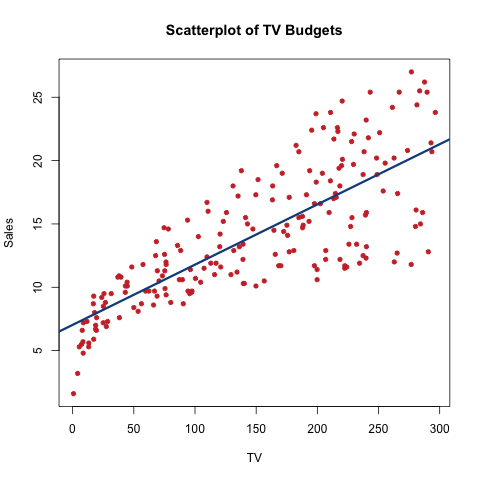

##Abstract
In this report we will reproduce the regression results on sales and advertising effectiveness displayed in section 3.2 Multiple Linear Regression (Chapter 3) of the book [**An Introduction to Statistical Learning**](http://www-bcf.usc.edu/~gareth/ISL/).

#Introduction
The specific goal of this report is to examine the relationship between sales (in terms of thousands of units sold) and advertising budget (in thousands of dollars). We will develop a simple linear regression model that will be used to predict sales on the basis of each of the three media budgets (**TV**, **Radio**, and **Newspaper**), as well as a multiple linear regression model used to predict sales on all three of the media budget types. This examination will allow us to better understand the effectiveness of different methods of advertising and improve the use of advertising to increase sales.

#Data
The Advertising data set, downloaded from _**An Introduction to Statistical Learning**_, consists of **Sales** (in thousands of units) of a particular product in 200 different markets, along with advertising budgets (in thousands of dollars) for the product in each of those markets for three different media: TV, Radio, and Newspaper.

#Methodology
For this report, we will only be using both simple linear regression as well as multiple linear regression.

### Simple Linear Regression
We be looking at each media type from the data set. We will examine the relationship of **Sales** of this product with **TV**/**Radio**/**Newspaper** advertising budget. We will use a simple linear model:
\begin{center}
 Sales  = $\beta_0$ + $\beta_1$ * TV/Radio/Newspaper
\end{center}
To estimate the coefficients $\beta_0$ and $\beta_1$, we will fit a regression model via the least squares criterion.

### Multiple Linear Regression
We will be looking at all the media types collectively and fit a multiple linear regression on sales taking all of the predictors into consideration. We will use the following model:
\begin{center}
 Sales  = $\beta_0$ + $\beta_1$ * TV + $\beta_2$ * Radio + $\beta_3$ * Newspaper
\end{center}
We will fit a regression model via the least squares criterion.

#Results
First, we computed the regression coefficients their that relative t values. The results is listed in the table below:
```{r,results = 'asis', echo=FALSE}
library(xtable)
load(file = "../data/regression.RData")
table_coef <- xtable(summary(regression),caption="Information about Regression Coefficients")
print(table_coef,comment = FALSE)
```
From this table, we can see that the coefficient for the regression of number of units sold on TV advertising budget indicates that an increase of $1,000 in the TV advertising budget will yield an increase in sales by 47.5 units. This number seems to indicate quite small of an effect. However, the coefficients of $\beta_0$ and $\beta_1$ are both quite large relative to their standard errors, and their t-stats are also quite large. This seems to indicate that $\beta_0$ and $\beta_1$ are significant, and that the null hypothesis that there's no relationship between the TV ad budget and number of units sold can be rejected.

Next, let's look at how well this regression model fits the data. We computed the Regression Quality Indices listed in the table below:
```{r,results = 'asis',echo=FALSE}
rqi <- data.frame(c("RSS","R2","F-stat"),c(summary(regression)$sigma,summary(regression)$r.squared,summary(regression)$fstatistic[1]))
colnames(rqi)<- c("Quantity","Value")
table_rqi <- xtable(rqi,caption = "Regression quality Indices")
print(table_rqi,comment=FALSE)
```
Looking at this table, a RSE of 3.26 on this regression model seems quite large. A 3260 units of average predicted deviation from sales is large relative to mean of Sales data of 14.0 thousand units, and this indicates that the fit of regression line to the data is not very good. R squared of 0.61 also seems to confirm the lack of fit of the regression line to the data, only 61% of the variability in sales can be explained by the regression on TV ad budget.

In fact we can observe this in our regression diagram shown below:



The deviation of the scatterplot from the regression line is quite significant and the spread gets larger as the level of TV ad budget increases.

#Conclusion
In conclusion, we examined the relationship between sales data in thousands of units sold and the TV advertising budget in thousands of dollars in this paper. We found a small but significant effect of TV ad budget on sales. An increase in TV ad budget of $1,000 can yield an increase of 47.5 units of product sold. The null hypothesis is rejected. However, we also found that this model may not be the best model to predict the relationship. The model fit is not ideal as indicated by the large RSE and the small R squared data. Looking at the diagram, it seems like the deviation of the predicted sales values deviate significantly from the regression line, and more so when the TV ad budget value increases. We might need to examine an alternative model to better determine the TV ad effectiveness on sales.
